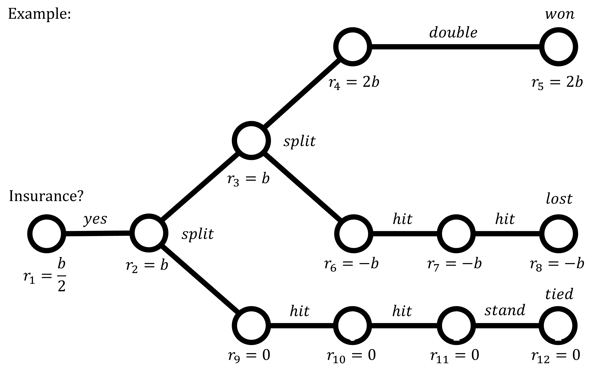

# Blackjack-Research

## Reinforcement Learning
### Node Params

### Reward Calculation

### Goals
1. Recreate basic strategy with deep reinforcement learning as a proof of concept.
2. Explore features that may improve on basic strategy, such as true count or something novel.
3. Find optimal bet spread with deep reinforcement learning.
4. Run simulations to find the probabilities that various bank rolls and number of sessions will yield a profit.
5. Repeat steps 2-4 until profit is maximized.
6. Explore evolutionary algorithms, if necessary.
7. Become millionaire.